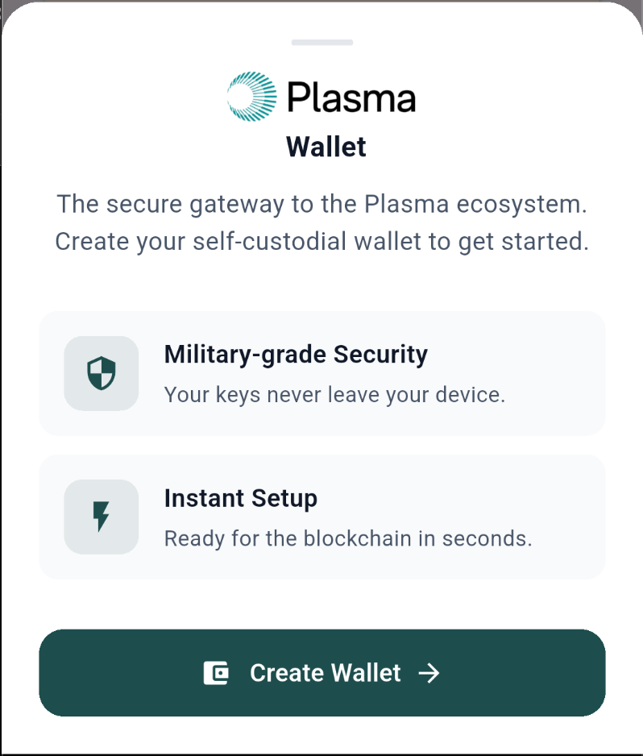
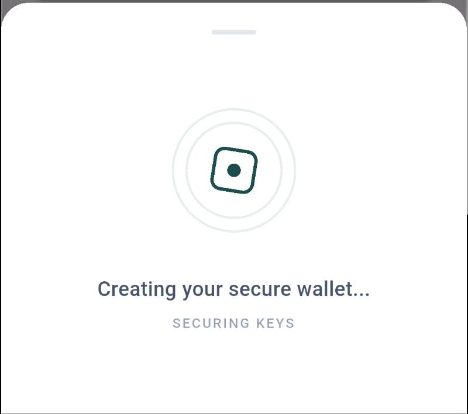
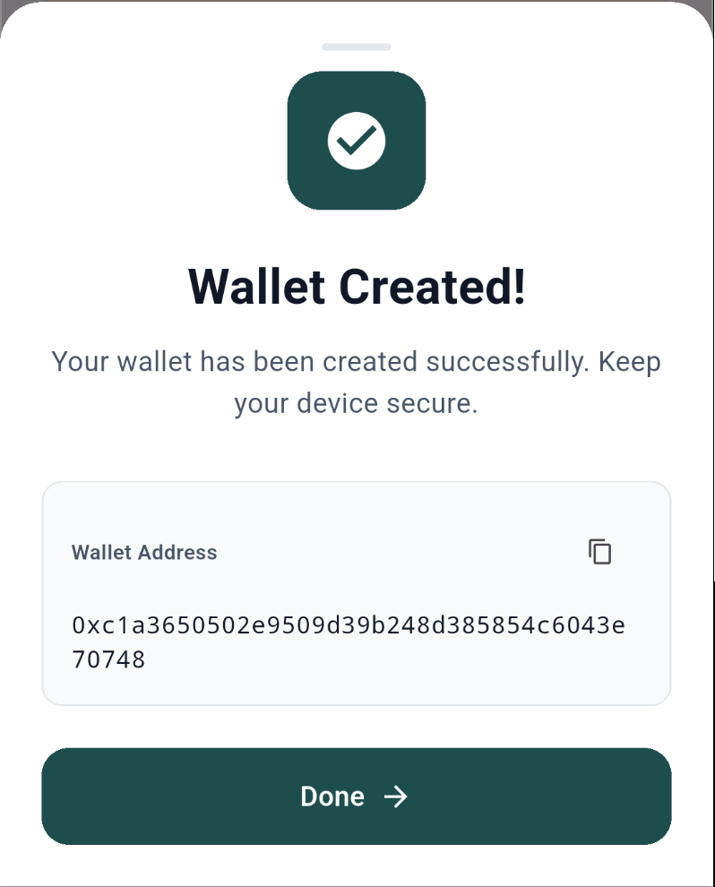

# Plasma SDK - UI Widgets Documentation

Beautiful, ready-to-use widgets for seamless wallet integration.

---

## Overview

The Plasma SDK provides pre-built UI components that handle the complete wallet lifecycle with beautiful animations and user-friendly interfaces. These widgets are designed to match modern design standards and can be integrated with a single line of code.

---

## Create Wallet Flow

### `showCreateWalletSheet()`

A beautiful bottom sheet that guides users through wallet creation with three distinct states.

**Features:**
- ✅ Three-state flow: Initial → Loading → Success
- ✅ Automatic SDK initialization check
- ✅ Smooth animations and transitions
- ✅ Plasma branding with your logo
- ✅ Copy wallet address functionality
- ✅ Error handling with user-friendly dialogs

---

### Usage

```dart
import 'package:plasma/plasma.dart';

// Initialize SDK first
await Plasma.instance.init(network: Network.testnet);

// Show create wallet sheet
await showCreateWalletSheet(context);
```

**Simple Integration:**
```dart
PlasmaButton(
  text: 'Get Started',
  icon: Icons.account_balance_wallet,
  onPressed: () => showCreateWalletSheet(context),
)
```

---

### User Journey

#### 1. Initial State - Onboarding


**What Users See:**
- Plasma logo and branding
- Clear "Plasma Wallet" title
- Descriptive tagline explaining the wallet
- Two feature cards highlighting benefits:
  - 🔒 **Military-grade Security** - "Your keys never leave your device"
  - ⚡ **Instant Setup** - "Ready for the blockchain in seconds"
- Prominent "Create Wallet" button

**User Action:** Tap "Create Wallet" to begin

---

#### 2. Loading State - Creating Wallet


**What Users See:**
- Animated geometric loading indicator
- Status message: "Creating your secure wallet..."
- Subtitle: "SECURING KEYS"
- Smooth rotation animation

**What's Happening:**
- Generating cryptographic keys
- Securely storing wallet in device Keychain/Keystore
- No user action needed - fully automated

**Duration:** 2-3 seconds

---

#### 3. Success State - Wallet Created


**What Users See:**
- Success icon (white checkmark on primary color)
- "Wallet Created!" confirmation
- Security reminder message
- Wallet address in a styled card:
  - Copy button for easy sharing
  - Monospace font for readability
  - Selectable text
- "Done" button to dismiss

**User Actions:**
- Copy wallet address
- Dismiss sheet and start using wallet

---

## Technical Details

### States

```dart
enum _WalletSheetState { 
  initial,   // Onboarding screen
  loading,   // Creating wallet
  success    // Wallet created
}
```

### Error Handling

**SDK Not Initialized:**
```dart
// Shows dialog if SDK not initialized
if (!Plasma.instance.isInitialized) {
  // Displays alert dialog
}
```

**Wallet Creation Failure:**
- Automatically closes sheet
- Shows error dialog with details
- User can retry

### Customization

The widget uses `PlasmaTheme` for consistent styling:

```dart
PlasmaTheme.primary        // Brand color (#1E4D4D)
PlasmaTheme.spacingXl      // Consistent spacing
PlasmaTheme.radiusXl       // Rounded corners
```

---

## Integration Checklist

- [x] Initialize Plasma SDK
- [x] Import Plasma package
- [x] Call `showCreateWalletSheet(context)`
- [x] Handle post-creation state (optional)

---

## Best Practices

1. **Always initialize SDK first**
   ```dart
   await Plasma.instance.init(network: Network.testnet);
   ```

2. **Check wallet status after sheet closes**
   ```dart
   await showCreateWalletSheet(context);
   if (Plasma.instance.hasWallet) {
     // Wallet created successfully
   }
   ```

3. **Use in onboarding flows**
   - Show during first app launch
   - Guide users to create wallet before accessing features

4. **Provide context**
   - Explain why users need a wallet
   - Show before transactions or blockchain interactions

---

## Additional UI Components

### PlasmaButton
Primary action button with loading state support.

### PlasmaLoadingWidget
Animated loading indicator with custom messaging.

### PlasmaFeatureCard
Feature highlight cards for benefits/features.

---

## Support

For more information, see:
- [Main Documentation](../../README.md)
- [API Reference](../API.md)
- [Examples](../../example/lib/main.dart)
